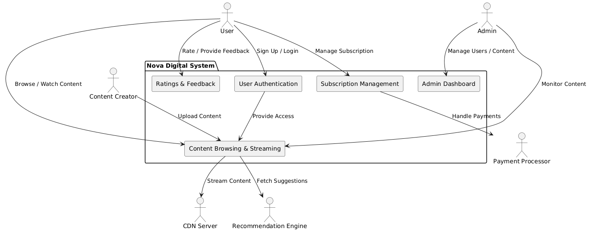

**1. System Context Diagram**

@startuml
' Define External Actors
actor "User" as User
actor "Admin" as Admin
actor "Content Creator" as ContentCreator
actor "Payment Processor" as PaymentProcessor
actor "CDN Server" as CDN
actor "Recommendation Engine" as RecommendationEngine

' Define System
package "Nova Digital System" {
    rectangle "User Authentication" as Authentication
    rectangle "Content Browsing & Streaming" as ContentSystem
    rectangle "Subscription Management" as SubscriptionSystem
    rectangle "Ratings & Feedback" as FeedbackSystem
    rectangle "Admin Dashboard" as AdminDashboard
}

' Relationships between Actors and the System
User --> Authentication : Sign Up / Login
User --> ContentSystem : Browse / Watch Content
User --> SubscriptionSystem : Manage Subscription
User --> FeedbackSystem : Rate / Provide Feedback

Admin --> AdminDashboard : Manage Users / Content
Admin --> ContentSystem : Monitor Content

ContentCreator --> ContentSystem : Upload Content

Authentication --> ContentSystem : Provide Access
ContentSystem --> CDN : Stream Content
ContentSystem --> RecommendationEngine : Fetch Suggestions

SubscriptionSystem --> PaymentProcessor : Handle Payments
@enduml
