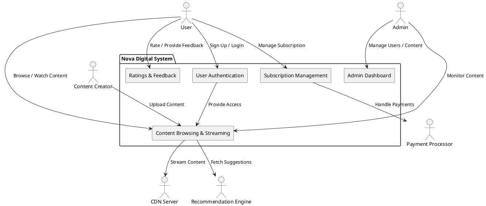
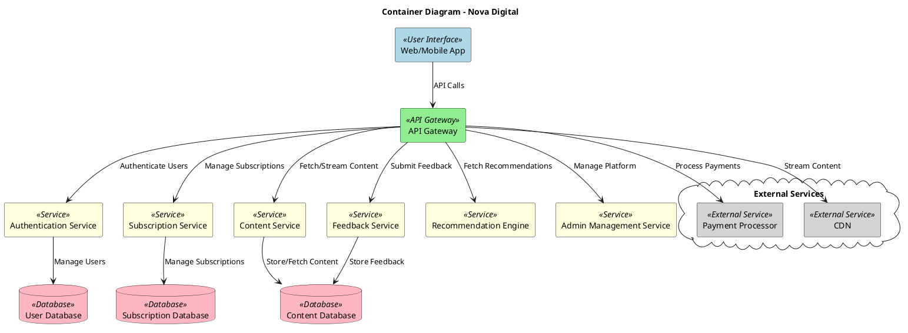
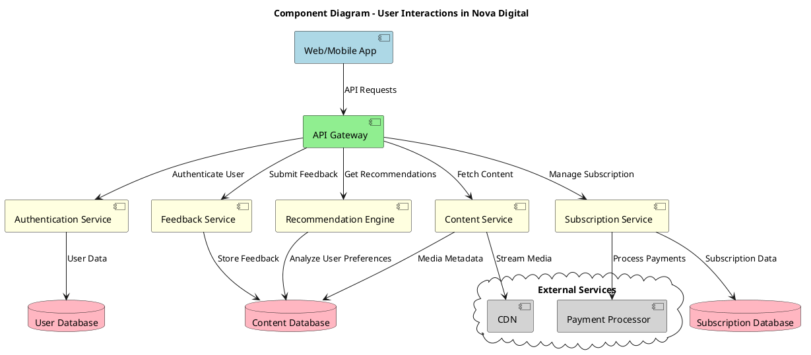
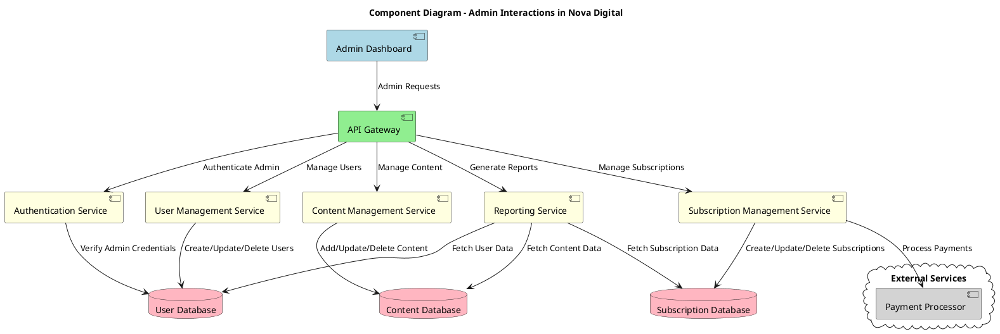

**1. System Context Diagram**

```plantuml
@startuml
actor "User" as User
actor "Admin" as Admin
actor "Content Creator" as ContentCreator
actor "Payment Processor" as PaymentProcessor
actor "CDN Server" as CDN
actor "Recommendation Engine" as RecommendationEngine

package "Nova Digital System" {
    rectangle "User Authentication" as Authentication
    rectangle "Content Browsing & Streaming" as ContentSystem
    rectangle "Subscription Management" as SubscriptionSystem
    rectangle "Ratings & Feedback" as FeedbackSystem
    rectangle "Admin Dashboard" as AdminDashboard
}

User --> Authentication : Sign Up / Login
User --> ContentSystem : Browse / Watch Content
User --> SubscriptionSystem : Manage Subscription
User --> FeedbackSystem : Rate / Provide Feedback

Admin --> AdminDashboard : Manage Users / Content
Admin --> ContentSystem : Monitor Content

ContentCreator --> ContentSystem : Upload Content

Authentication --> ContentSystem : Provide Access
ContentSystem --> CDN : Stream Content
ContentSystem --> RecommendationEngine : Fetch Suggestions

SubscriptionSystem --> PaymentProcessor : Handle Payments
@enduml
```

**2. Container Diagram**

```plantuml
@startuml
title Container Diagram - Nova Digital

rectangle "Web/Mobile App" as App <<User Interface>> #lightblue
rectangle "API Gateway" as APIGateway <<API Gateway>> #lightgreen
rectangle "Authentication Service" as AuthService <<Service>> #lightyellow
rectangle "Content Service" as ContentService <<Service>> #lightyellow
rectangle "Subscription Service" as SubscriptionService <<Service>> #lightyellow
rectangle "Feedback Service" as FeedbackService <<Service>> #lightyellow
rectangle "Recommendation Engine" as RecommendationEngine <<Service>> #lightyellow
rectangle "Admin Management Service" as AdminService <<Service>> #lightyellow

database "User Database" as UserDB <<Database>> #lightpink
database "Content Database" as ContentDB <<Database>> #lightpink
database "Subscription Database" as SubDB <<Database>> #lightpink

cloud "External Services" {
    rectangle "Payment Processor" as PaymentProcessor <<External Service>> #lightgray
    rectangle "CDN" as CDN <<External Service>> #lightgray
}

App --> APIGateway : API Calls
APIGateway --> AuthService : Authenticate Users
APIGateway --> ContentService : Fetch/Stream Content
APIGateway --> SubscriptionService : Manage Subscriptions
APIGateway --> FeedbackService : Submit Feedback
APIGateway --> RecommendationEngine : Fetch Recommendations
APIGateway --> AdminService : Manage Platform
APIGateway --> PaymentProcessor : Process Payments
APIGateway --> CDN : Stream Content

AuthService --> UserDB : Manage Users
ContentService --> ContentDB : Store/Fetch Content
SubscriptionService --> SubDB : Manage Subscriptions
FeedbackService --> ContentDB : Store Feedback
@enduml

```

**3. Component Diagram**
*3.1 Component Diagram for users*
.png)

```plantuml
@startuml
title Component Diagram - User Interactions in Nova Digital

component "Web/Mobile App" as App #lightblue
component "API Gateway" as APIGateway #lightgreen
component "Authentication Service" as AuthService #lightyellow
component "Content Service" as ContentService #lightyellow
component "Subscription Service" as SubscriptionService #lightyellow
component "Feedback Service" as FeedbackService #lightyellow
component "Recommendation Engine" as RecommendationEngine #lightyellow

database "User Database" as UserDB #lightpink
database "Content Database" as ContentDB #lightpink
database "Subscription Database" as SubDB #lightpink

cloud "External Services" {
    component "CDN" as CDN #lightgray
    component "Payment Processor" as PaymentService #lightgray
}

App --> APIGateway : API Requests
APIGateway --> AuthService : Authenticate User
AuthService --> UserDB : User Data

APIGateway --> ContentService : Fetch Content
ContentService --> ContentDB : Media Metadata
ContentService --> CDN : Stream Media

APIGateway --> SubscriptionService : Manage Subscription
SubscriptionService --> SubDB : Subscription Data
SubscriptionService --> PaymentService : Process Payments

APIGateway --> FeedbackService : Submit Feedback
FeedbackService --> ContentDB : Store Feedback

APIGateway --> RecommendationEngine : Get Recommendations
RecommendationEngine --> ContentDB : Analyze User Preferences

@enduml
```

*3.2 Component Diagram for Admins*
.png)

```plantuml
@startuml
title Component Diagram - Admin Interactions in Nova Digital

component "Admin Dashboard" as AdminDashboard #lightblue
component "API Gateway" as APIGateway #lightgreen
component "Authentication Service" as AuthService #lightyellow
component "User Management Service" as UserService #lightyellow
component "Content Management Service" as ContentService #lightyellow
component "Subscription Management Service" as SubscriptionService #lightyellow
component "Reporting Service" as ReportingService #lightyellow

database "User Database" as UserDB #lightpink
database "Content Database" as ContentDB #lightpink
database "Subscription Database" as SubDB #lightpink

cloud "External Services" {
    component "Payment Processor" as PaymentService #lightgray
}

AdminDashboard --> APIGateway : Admin Requests
APIGateway --> AuthService : Authenticate Admin
AuthService --> UserDB : Verify Admin Credentials

APIGateway --> UserService : Manage Users
UserService --> UserDB : Create/Update/Delete Users

APIGateway --> ContentService : Manage Content
ContentService --> ContentDB : Add/Update/Delete Content

APIGateway --> SubscriptionService : Manage Subscriptions
SubscriptionService --> SubDB : Create/Update/Delete Subscriptions
SubscriptionService --> PaymentService : Process Payments

APIGateway --> ReportingService : Generate Reports
ReportingService --> UserDB : Fetch User Data
ReportingService --> ContentDB : Fetch Content Data
ReportingService --> SubDB : Fetch Subscription Data
@enduml

```