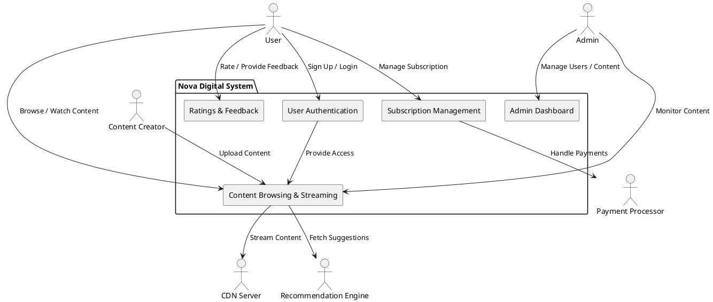

**1. System Context Diagram**

**2. Container Diagram**
![Container Diagram][assets/container_diagram.png]
@startuml
title Container Diagram - Nova Digital

rectangle "Web/Mobile App" as App <<User Interface>> #lightblue
rectangle "API Gateway" as APIGateway <<API Gateway>> #lightgreen
rectangle "Authentication Service" as AuthService <<Service>> #lightyellow
rectangle "Content Service" as ContentService <<Service>> #lightyellow
rectangle "Subscription Service" as SubscriptionService <<Service>> #lightyellow
rectangle "Feedback Service" as FeedbackService <<Service>> #lightyellow
rectangle "Recommendation Engine" as RecommendationEngine <<Service>> #lightyellow
rectangle "Admin Management Service" as AdminService <<Service>> #lightyellow

database "User Database" as UserDB <<Database>> #lightpink
database "Content Database" as ContentDB <<Database>> #lightpink
database "Subscription Database" as SubDB <<Database>> #lightpink

cloud "External Services" {
    rectangle "Payment Processor" as PaymentProcessor <<External Service>> #lightgray
    rectangle "CDN" as CDN <<External Service>> #lightgray
}

App --> APIGateway : API Calls
APIGateway --> AuthService : Authenticate Users
APIGateway --> ContentService : Fetch/Stream Content
APIGateway --> SubscriptionService : Manage Subscriptions
APIGateway --> FeedbackService : Submit Feedback
APIGateway --> RecommendationEngine : Fetch Recommendations
APIGateway --> AdminService : Manage Platform
APIGateway --> PaymentProcessor : Process Payments
APIGateway --> CDN : Stream Content

AuthService --> UserDB : Manage Users
ContentService --> ContentDB : Store/Fetch Content
SubscriptionService --> SubDB : Manage Subscriptions
FeedbackService --> ContentDB : Store Feedback
@enduml