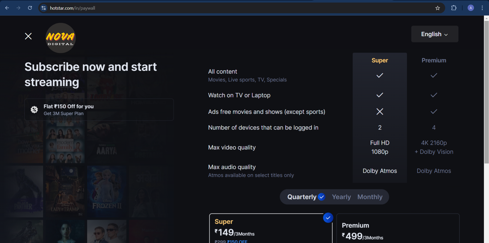

# URD Documetation

## Introduction

NOVA Digital is an online streaming platform that offers a wide range of content, including movies, TV shows, documentaries, and original series, in multiple languages. The platform provides users with a personalized viewing experience and allows them to stream content on various devices, including smartphones, tablets, smart TVs, and computers.

Overall, the objective of NOVA Digital is to deliver an engaging and immersive entertainment experience through high-quality content, seamless navigation, and personalized recommendations.

### Why would you as a user love streaming with NOVA Digital?

1. Vast Content Library: Access to a wide variety of genres, including movies, TV shows, documentaries, and exclusive originals.
2. Personalized Recommendations: Using advanced algorithms, NOVA Digital recommends content tailored to your viewing preferences and habits.
3. Multi-Device Access: Stream content across multiple devices, from smartphones to smart TVs, for uninterrupted viewing anytime, anywhere.
4. Offline Viewing: Download shows and movies to watch offline, making it convenient for travel or when internet access is limited.
5. No Ads: Enjoy an uninterrupted, ad-free experience on premium plans.

## User Constraints and Assumptions

### Constraints:

- Content Availability: Not all content may be available in every region due to licensing restrictions.
- Device Compatibility: Users may experience limitations based on their device's operating system or version, affecting compatibility with the platform.
- Internet Access: A stable internet connection is required for smooth streaming, particularly for high-definition and 4K content.
- Subscription Requirement: Most content is behind a paywall, and users need a valid subscription to access the platform's full library.

### Assumptions:

- User Internet Connectivity: It is assumed that users have access to a reliable and fast internet connection for uninterrupted streaming.
- User Device Capability: NOVA Digital assumes that users' devices (smartphones, tablets, TVs, etc.) are compatible with the platform's technical requirements.
- User Preferences: The platform assumes that users will engage with personalized content suggestions based on their viewing history and interactions.
- User Willingness to Subscribe: It is assumed that users are willing to subscribe to access premium content.

## User Requirements:

1. Content Selection: Users should be able to browse through a large library of movies, TV shows, and original series based on genres, languages, popularity, and personal recommendations. They can also search for specific titles using a search bar.
   
2. User Profile: Users should be able to create and manage personal profiles with information such as name, email, password, and viewing preferences. Each user profile will have its own recommendations, viewing history, and watchlist.

3. Subscription Management: Users should be able to choose from different subscription plans (e.g., Basic, Standard, Premium) based on their viewing needs. They can upgrade, downgrade, or cancel their subscriptions at any time.

4. Content Playback and Control: Users should be able to start, pause, rewind, fast-forward, and stop videos at any point. They can choose different resolutions (SD, HD, 4K) based on their internet speed and device capability.

5. Multiple User Profiles: The platform should support multiple user profiles under a single subscription plan. For example, a family can have different profiles for parents, children, etc., each with personalized recommendations and watch histories.

6. Offline Viewing: Users should be able to download select content to their devices to watch offline, with the ability to manage downloads and storage space.

7. Content Recommendations: Based on the user’s watch history, the platform should provide personalized recommendations for movies and TV shows.

8. Parental Controls: The platform should include parental control options, allowing users to set restrictions on content based on ratings (e.g., blocking R-rated or mature content).

9. Multi-Device Streaming: Users should be able to stream content across different devices like smartphones, tablets, laptops, and smart TVs. The number of simultaneous streams should depend on the subscription plan.

10. Watchlist: Users should be able to add content to a watchlist to save movies and shows for future viewing.

11. Resume Watching: Users should have the option to resume watching content from where they left off, even if they switch between devices.

12. User Ratings and Reviews: Users should be able to rate and review content to help others discover popular or trending shows and movies.

13. Notification and Alerts: Users should receive notifications about new releases, expiring content, or recommendations based on their preferences.

## User Flow
Persona - Aarav is a young professional who enjoys binge-watching movies and TV series in his spare time. He subscribes to NOVA Digital for its wide content library and seamless user experience.

1. Sign Up/Log In: Aarav opens the NOVA Digital website or app, where he is greeted by a splash screen and then prompted to sign in. As a first-time user, Aarav opts to sign up by entering his name, email, and password. Alternatively, he can sign up using social media or Google accounts.

    - Returning Users: For returning users, they can log in using their registered email or phone number.

2. Subscription Selection: Aarav is prompted to choose a subscription plan (Basic, Standard, or Premium), each with different pricing and features. He chooses the plan that suits his streaming needs and completes the payment.

3. Profile Setup: Aarav sets up his profile by selecting an avatar, providing his name, and indicating his preferred languages and genres. Since multiple profiles are supported, he also sets up profiles for other members of his household.

4. Home Screen: Aarav is taken to the home screen, which displays recommended content based on his preferences. He can browse through various categories such as Trending, New Releases, Popular on NOVA Digital, and Genres (e.g., Comedy, Thriller).

5. Search & Browse: Aarav uses the search bar to find a specific movie or show, or he navigates through categories. He can also view trending shows, top picks, or new arrivals.

6. Content Details: After selecting a movie or show, Aarav is presented with detailed information, including the title, synopsis, cast, and user ratings. He can choose to play the content immediately or add it to his watchlist for later.

7. Playback and Controls: Aarav starts watching the movie, and he can adjust settings like subtitles, audio language, video quality, and screen size. He can pause, skip, or rewind using the playback controls.

8. Recommendations and Notifications: After watching a few movies, NOVA Digital learns his viewing preferences and starts recommending similar content. Aarav receives notifications about new content added to his favorite genres or upcoming releases.

9. Profile Management and Subscription: Aarav can access his account settings to update his subscription plan, payment details, or manage profiles. He can also view his viewing history, manage downloads, and see the number of devices logged into his account.

10. Offline Viewing: Aarav downloads his favorite TV series to watch offline while traveling. He can manage his downloads from the app and delete them when he no longer needs them.

11. Parental Controls: Aarav sets up parental controls on his child’s profile to restrict access to mature content and set a PIN for content rated above a certain age level.

12. Logout: After watching, Aarav logs out of the app, knowing that he can resume his content from the same spot when he returns later.

