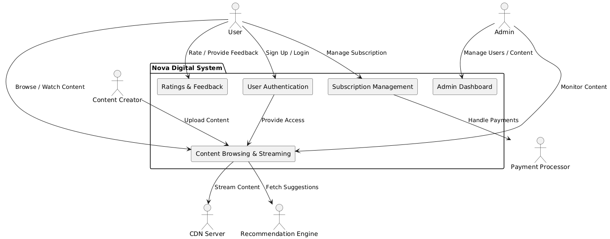
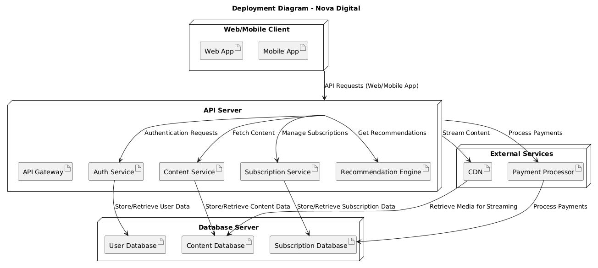

# Architecture 
## 1. System Context Diagram
The Diagram provides a high-level overview of how NOVA-DIGITAL interacts with its key stakeholders and external systems. It illustrates the roles of various actors (users, admins, content creators) and how they interact with system components like user authentication, content streaming, subscription management, and feedback collection. Additionally, it highlights integrations with external systems like the CDN, payment processor, and recommendation engine.

## 2. Container Diagram
The diagram depicts the system's primary building blocks and how they communicate. NOVA-DIGITAL is divided into several containers:
- Web/Mobile App: The user-facing interface for browsing and streaming content.
- API Gateway: Acts as the intermediary between the frontend and backend services.
- Core Services: Includes authentication, content, subscription, feedback, and recommendation services.
- Databases: Stores user data, content metadata, and subscription records.
- External Services: Interactions with external systems like the payment processor and CDN.

## 3. Component Diagram

### 3.1 Component Diagram for users
This diagram focuses on the components that facilitate user interactions within NOVA-DIGITAL. Users interact with the Web/Mobile App to browse content, stream videos, manage subscriptions, and provide feedback. The API Gateway routes these requests to appropriate backend services:
- Authentication Service verifies user credentials.
- Content Service handles media data and streaming.
- Subscription Service manages payment and plan details.
- Feedback Service stores user feedback.
- Recommendation Engine analyzes user behavior for personalized suggestions.

.png)

### 3.2 Component Diagram for Admins
This diagram highlights the administrative functionalities of NOVA-DIGITAL. Admins use the Admin Dashboard to manage users, content, and subscriptions. The API Gateway directs admin requests to services like:
- User Management Service: Handles CRUD operations for users.
- Content Management Service: Enables admins to monitor and manage uploaded content.
- Subscription Management Service: Oversees subscription plans and user payments.
- Reporting Service: Provides analytical insights using user, content, and subscription data.

.png)

## 4. Deployment Diagram
The diagram illustrates how NOVA-DIGITAL is deployed across different environments. The architecture is divided into:
- Client Layer: Represents the Web and Mobile Apps accessed by end users.
- API Server Layer: Hosts the API Gateway and core services (authentication, content, subscription, feedback, and recommendation).
- Database Layer: Contains the databases storing user, content, and subscription data.
- External Services Layer: Includes the CDN for content delivery and the payment processor for handling transactions.

